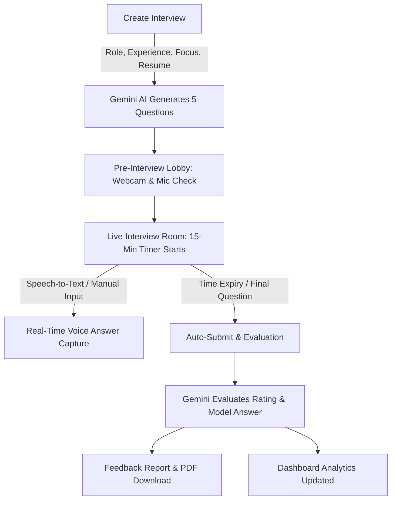

# 🚀 Mock Mate - AI Mock Interview Platform

[](https://nextjs.org/)
[](https://react.dev/)
[](https://ai.google.dev/)
[](https://neon.tech/)
[](https://orm.drizzle.team/)
[](https://clerk.com/)
[](https://tailwindcss.com/)

**Mock Mate** is a full-stack, AI-powered interview preparation platform designed to help job seekers practice realistic technical, system design, and behavioral interviews. Built with Next.js 16, Google Gemini AI, Neon Serverless PostgreSQL, and Drizzle ORM, Mock Mate provides real-time voice and webcam simulation, pressure-tested countdown timers, instant AI evaluations, and downloadable feedback reports.

---

## 🌟 Key Features

### 🧠 1. Smart AI Interview Configuration
- **Dynamic Role Generation**: Generate tailored interview questions based on Job Title, Years of Experience, and Tech Stack.
- **Resume or Job Description Input**: Paste job descriptions or candidate resumes directly into the generator to tailor questions specifically to your background.
- **Difficulty Selection**: Configure question complexity across **Junior / Entry-Level**, **Mid-Level**, **Senior / Lead**, or **Staff / Architect**.
- **Interview Focus Modes**:
  - **Technical & Coding**: Conceptual, algorithmic, language-specific questions.
  - **System Design & Architecture**: Scalability, database design, caching, and microservices.
  - **Behavioral (STAR Method)**: Situation, Task, Action, Result leadership & culture-fit questions.
  - **Comprehensive / Mixed**: Balanced real-world interview session.

### 🎙️ 2. Real-Time Interview Simulation & Voice Recording
- **Webcam & Mic Lobby**: Preview camera feed and test audio permissions before entering the interview room.
- **Live Speech-to-Text**: Real-time voice answer transcription powered by browser speech recognition.
- **Text Answer Fallback**: Edit or type answers manually for maximum flexibility.
- **Text-to-Speech (Audio Readout)**: Listen to interview questions read aloud naturally using the Web Speech API.
- **Skip & Unattempted Recording**: Questions navigated away from or left blank are automatically recorded as `"answer unattempted"` with 0/10 rating.

### ⏱️ 3. Real-Time Countdown Timer & Pressure Simulation
- **Top-Right Reverse Timer**: Counts down in reverse from `15:00` down to `00:00` to simulate authentic interview time limits.
- **Adaptive Visual Warning Badges**:
  - 🔵 **Normal State**: Clean badge with countdown clock.
  - 🟡 **Warning State (< 5m)**: Amber highlight alerting candidate to pace answers.
  - 🔴 **Alert State (< 2m)**: Red badge with pulsating animations.
- **Auto-Submit on Expiry**: Automatically saves the active question and finalizes the interview session when time expires.

### 📊 4. Dashboard Performance & Analytics Metrics
- Located directly below interview session cards with dedicated performance badges:
  - **Total Mock Sessions**: Count of all created interviews.
  - **Overall Average Score**: Aggregate score across all evaluated responses (`X.X/10`).
  - **Questions Attempted vs. Skipped**: Detailed completion rate percentage.
  - **Top Targeted Role**: Highlights the candidate's most practiced or highest-scoring job position.

### 📄 5. Downloadable Feedback Report (PDF / Print)
- **Comprehensive Review**: Compare candidate responses against AI model answers side-by-side.
- **Granular Scoring**: Ratings (out of 10) and actionable improvement suggestions for every answer.
- **Instant Print & PDF Export**: One-click print stylesheet (`@media print`) that automatically expands all questions and sections cleanly onto paper or PDF without navigation clutter.

### ❓ 6. Custom Question AI Practice Hub
- Ask individual custom technical or behavioral questions to AI anytime.
- Save questions and view AI-crafted model answers.
- Delete individual questions or interview sessions with safe confirmation dialogs.

---

## 🛠️ Tech Stack

| Category | Technology |
| :--- | :--- |
| **Framework** | [Next.js 16](https://nextjs.org/) (App Router, Turbopack) |
| **Library** | [React 19](https://react.dev/) |
| **AI Model** | [Google Gemini 2.5 Flash](https://ai.google.dev/) via `@google/genai` |
| **Authentication** | [Clerk Auth](https://clerk.com/) (`@clerk/nextjs`) |
| **Database** | [Neon](https://neon.tech/) Serverless PostgreSQL |
| **ORM** | [Drizzle ORM](https://orm.drizzle.team/) & [Drizzle Kit](https://orm.drizzle.team/kit-docs/overview) |
| **Styling** | [Tailwind CSS v4](https://tailwindcss.com/), Radix UI Primitives, Lucide Icons |
| **Speech & Media** | `react-hook-speech-to-text`, `react-webcam`, Web Speech API |
| **Notifications** | [Sonner](https://sonner.emilkowal.ski/) Toasts |

---

## 📂 Project Architecture

```
Ai-Interview-Mocker/
├── app/
│   ├── (auth)/                      # Clerk Authentication routes (Sign-in / Sign-up)
│   ├── dashboard/                   # Main candidate dashboard
│   │   ├── _components/             # Dashboard modular components
│   │   │   ├── AddNewInterview.jsx  # Interview creation modal (Difficulty, Focus, Resume)
│   │   │   ├── Header.jsx           # Responsive navbar with mobile hamburger menu
│   │   │   ├── InterviewItemCard.jsx# Individual interview card with delete modal
│   │   │   └── InterviewList.jsx    # Interview grid + Performance Analytics section
│   │   ├── how/                     # "How it Works" guide page
│   │   ├── interview/[interviewID]/ # Pre-interview webcam lobby & guidelines
│   │   │   ├── start/               # Live interview room with timer & speech-to-text
│   │   │   │   └── _components/     # Question audio readout & recording components
│   │   │   └── feedback/            # Detailed feedback page with PDF/Print export
│   │   ├── question/                # Custom AI Question Practice hub
│   │   └── upgrade/                 # Pro upgrade plan showcase
│   ├── layout.js                    # Root layout with ClerkProvider, Toaster & Footer
│   ├── globals.css                  # Global styles, Tailwind directives & print CSS
│   └── page.js                      # Public landing / hero page
├── components/
│   ├── ui/                          # Reusable UI primitives (Dialog, Button, Collapsible, Textarea)
│   └── Footer.jsx                   # Global footer with author credits & GitHub link
├── utils/
│   ├── db.js                        # Neon PostgreSQL connection client
│   ├── GeminiAIModal.js             # Google GenAI SDK wrapper (gemini-2.5-flash)
│   └── schema.js                    # Drizzle PostgreSQL schemas (MockInterview, UserAnswer, UserAskedQuestion)
├── drizzle.config.js                # Drizzle ORM configuration
├── package.json                     # Project dependencies and npm scripts
└── README.md                        # Documentation
```

---

## ⚡ Getting Started

### 1. Prerequisites
Ensure you have the following installed:
- [Node.js](https://nodejs.org/) version 18.x or higher
- `npm`, `pnpm`, or `yarn`
- A [Google AI Studio API Key](https://aistudio.google.com/)
- A [Neon PostgreSQL Database](https://neon.tech/) instance
- A [Clerk](https://clerk.com/) application account

### 2. Clone Repository
```bash
git clone https://github.com/Tanishpal23/Ai-Interiew-Mocker.git
cd Ai-Interiew-Mocker
```

### 3. Install Dependencies
```bash
npm install
```

### 4. Configure Environment Variables
Create a `.env.local` file in the root directory and add the following keys:

```env
# Clerk Authentication
NEXT_PUBLIC_CLERK_PUBLISHABLE_KEY=your_clerk_publishable_key
CLERK_SECRET_KEY=your_clerk_secret_key
NEXT_PUBLIC_CLERK_SIGN_IN_URL=/sign-in
NEXT_PUBLIC_CLERK_SIGN_UP_URL=/sign-up

# Neon Serverless PostgreSQL Database URL (Server-Only, Secure)
DRIZZLE_DB_URL=postgresql://<user>:<password>@<endpoint>.neon.tech/<dbname>?sslmode=require

# Google Gemini AI API Key (Server-Only, Secure)
GEMINI_API_KEY=your_google_gemini_api_key

# Instructional Copy
NEXT_PUBLIC_INFORMATION="Enable video web cam and microphone to start your AI Generated Mock Interview. It has 5 questions which you can answer and at last you will get the report on the basis of your answers."
NEXT_PUBLIC_QUESTION_NOTE="Click on Record Answer when you are ready to speak. You can also edit your answer in the text box."
```

### 5. Push Database Schema
Push the Drizzle schema to your Neon PostgreSQL database:
```bash
npm run db:push
```

To view or manage database records visually:
```bash
npm run db:studio
```

### 6. Run the Development Server
```bash
npm run dev
```

Open [http://localhost:3000](http://localhost:3000) in your browser.

---

## 📜 Available Scripts

| Command | Purpose |
| :--- | :--- |
| `npm run dev` | Starts the Next.js development server with hot reload |
| `npm run build` | Builds the optimized production application |
| `npm run start` | Runs the compiled production server |
| `npm run lint` | Runs Next.js ESLint checks |
| `npm run db:push` | Pushes the Drizzle ORM schema directly to Neon DB |
| `npm run db:studio` | Launches Drizzle Studio GUI on local browser |

---

## 🧭 How It Works



1. **Configure**: Specify Job Position, Experience, Difficulty (Junior to Staff), Focus Area, and optionally paste your Resume or Job Description.
2. **Setup**: Test your webcam and audio in the pre-interview lobby.
3. **Simulate**: Answer 5 targeted questions with live speech-to-text, audio question readouts, and a real-time countdown timer.
4. **Evaluate**: Review side-by-side answers, ratings out of 10, and specific improvement pointers.
5. **Download**: Export the full performance feedback report as a cleanly styled PDF.

---

## 👤 Author

Developed with ❤️ by **Tanish**
- **GitHub**: [@Tanishpal23](https://github.com/Tanishpal23)
- **Repository**: [Ai-Interiew-Mocker](https://github.com/Tanishpal23/Ai-Interiew-Mocker)

---

## 📄 License
This project is open source and available under the [MIT License](LICENSE).
